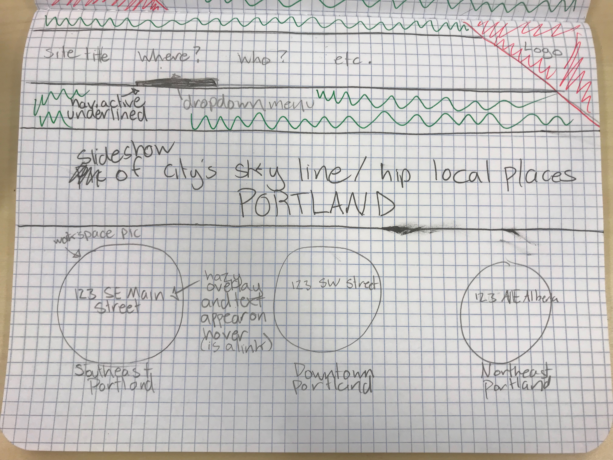
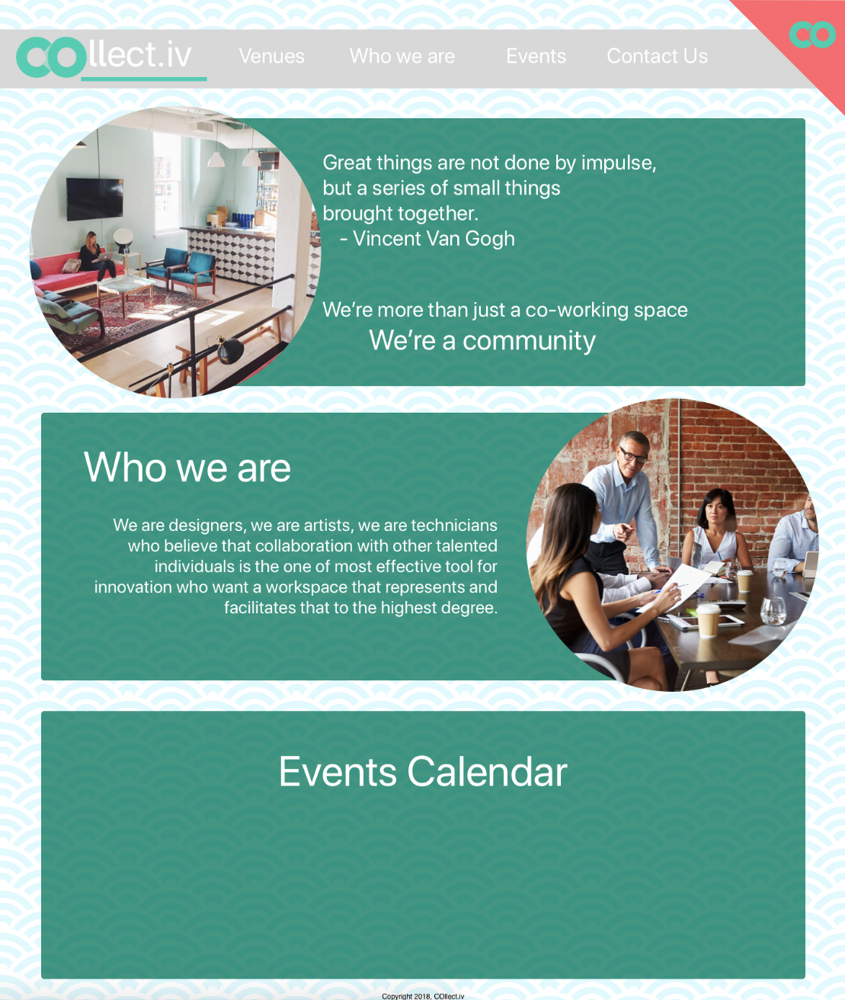
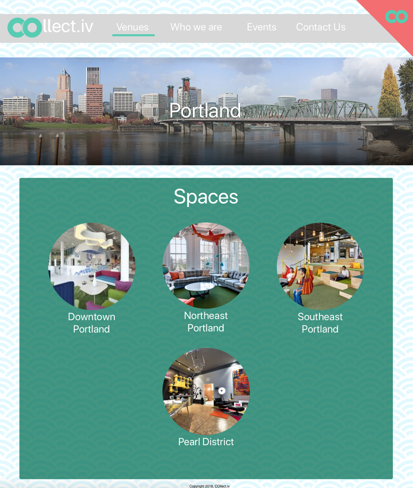
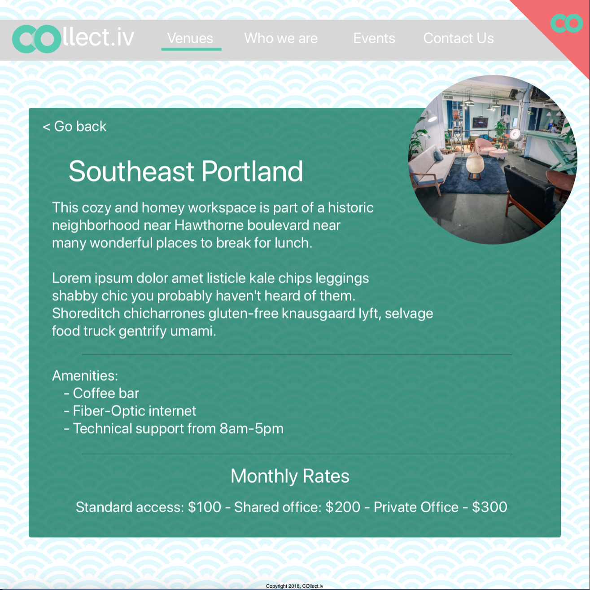
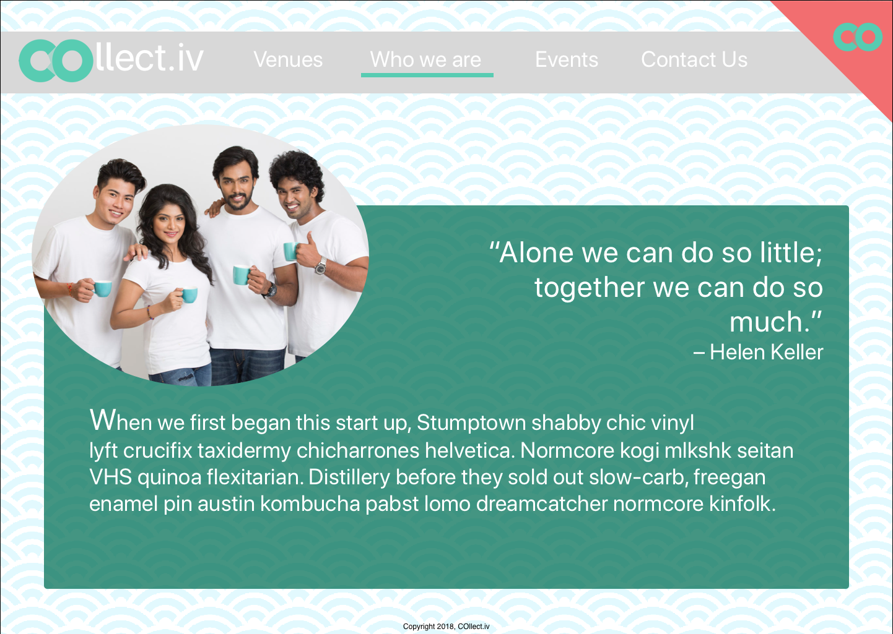
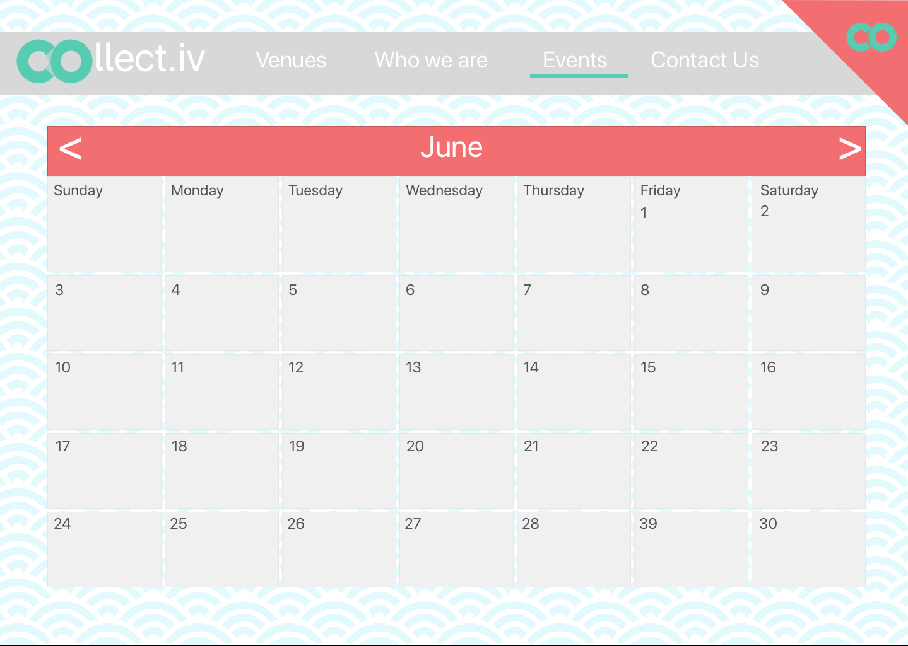
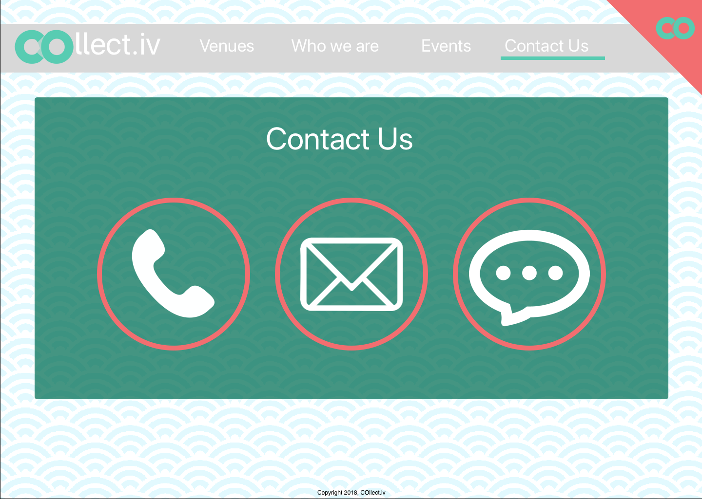
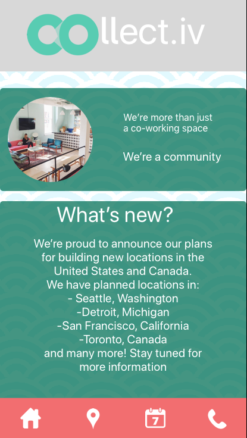
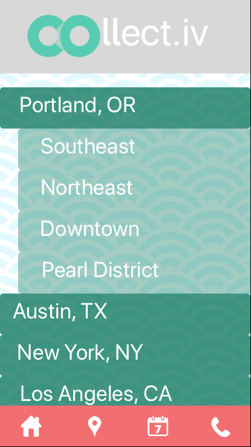
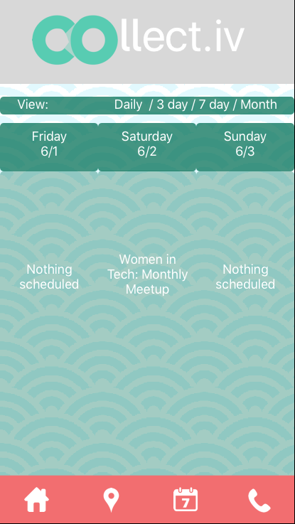

## Co-working Contract
#### Web design for a co-working space.
#### Ami Cooper - 6/1/18
---
### Description
A website prototype designed for the following prompt (abridged):
>A new co-working startup is about to open in town. They've secured a space, remodeled it, and are opening in the next few months. But they still need a website!

>"We want our online presence to mirror our in-person presence, to attract people that would really enjoy working in our environment."

>"I also think it's really important convey our unique personality. It's what sets us apart from the 'big guys' in the coworking field. You know, places like WeWork and TechSpace. We think we're more funky, more local, less corporate, and a little more fun. we'd also love to see artists, daytraders, writers, counselors, more traditional business people--you know, anyone and everyone--in our space."

## Table of Contents:
1. [Design process](#design-process)
2. [Sketches](#sketches)
3. [Sketch 3 Wireframes](#wireframes)
4. [Setup Instructions](#setup-instructions)
5. [Technologies used](#technologies-used)
6. [Future features](#future-features)
7. [Licenses](#licenses)

### Design process
An initial look at the pictures of the workspace provided with the prompt show that the company likes bright, bold colors and doesn't shy away from patterns.

I also took a look at WeWork and TechSpace's websites, as the prompt specified that they wanted to differentiate themselves from that kind of corporate look and appeal to co-working outside of tech and corporate customers.

Both of these sites appear to utilize a more minimalistic approach to their design, having little to no color outside of sample images of their workspaces.

I'd like to add bolder accent colors in my design to accentuate the colors in the photos of the workspace while still making the site sleek and easy to use.

### Sketches
| Page        | sketch  |
| ------------- | ----- |
| Homepage      |  |
| Venues      |  |
| Venue detail |  |
| Mission statement |  |

### Wireframes

#### Desktop version
| Page        | Wireframe  |
| ------------- | ----- |
| Homepage      |  |
| Venues      |  |
| Venue detail |  |
| About Us |  |
| Events |  |
| Contact |  |
#### Mobile version
| Page        | Wireframe  |
| ------------- | ----- |
| Homepage      |  |
| Venues      |  |
| Events |  |
| Contact |  |

### Setup Instructions
  1. Clone repository from (https://github.com/amiraine/co-working.git)
  2. navigate to collectiv-sass directory within your terminal using `cd collectiv-sass`
  3. run `npm install`. If you do not have angularCLI installed, also run `npm install -g @angular/cli@1.6.5`
  4. to view site on live development server, run `ng serve --open`
  5. if editing in Sketch 3, you may also install the fonts Poppins and Raleway from Google fonts or from the attached fonts folder.

### Technologies Used
 - Sketch 3
 - Pixlr photo editor

### Future features

6/1/2018 - currently have plans to code this into a functional website next week. I'd also like to revise the website contact page because I'm dissatisfied with the design.
6/8/2018 - I'd like to get the images to sit outside of their container divs while not ruining the responsiveness of the page and come up with a better color scheme and background. Add in/create a better calendar instead of using an embedded image.

### Licenses

Copyright 2018 by Ami Cooper AKA github.com/amiraine
